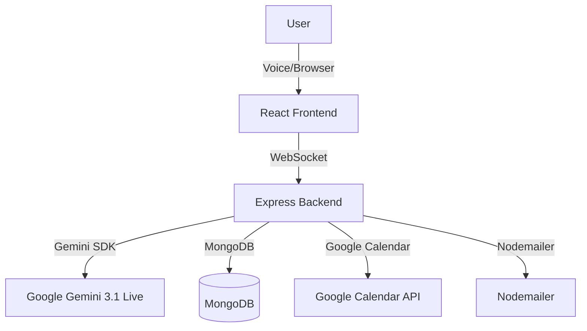

# TechIndiana Architecture & Schema Guide

## Overview
TechIndiana is an AI-driven apprenticeship and career navigation platform. It uses Google Gemini 3.1 Live API for voice-based guidance, dynamic UI routing, calendar scheduling, resource delivery, and skills assessment. The backend is Node.js/Express with MongoDB, and the frontend is React (with React Router).

---

## System Architecture



- **VoiceAgent**: Handles live voice, AI, and WebSocket events.
- **Gemini Session**: Orchestrates tool calls, context, and synchronous function responses.
- **MongoDB**: Stores user profiles, study plans, skills, and context.
- **Google Calendar**: Books meetings for employers, parents, and students.
- **Nodemailer**: Delivers resources (PDFs/links) to users.

---

## Key Backend Schemas

### UserProfile (Mongoose)
```js
firebaseUid: { type: String, required: true, unique: true },
name: String,
email: String,
background: String,
expectations: String,
study_plan: Mixed, // Object or String
conversation_summary: String,
assessed_skills: {
  current_role: String,
  past_experience: String,
  recommended_pathway: String,
  estimated_timeline: String
}
```

---

## Gemini Tooling (Function Declarations)
- **present_study_plan**: Shows a study plan in the UI.
- **route_user_to_persona_page**: Triggers a UI redirect.
- **schedule_partnership_call**: Books a partnership call (Google Calendar).
- **schedule_advisor_call**: Books an advisor call (Google Calendar).
- **send_counselor_toolkit**: Emails the Counselor Toolkit.
- **send_parent_guide**: Emails the Parent Guide.
- **assess_adult_skills**: Maps adult experience to IT pathway.

---

## Product Flow
1. **User logs in** and starts a voice session.
2. **AI gathers persona, context, and needs**.
3. **AI triggers tool calls** (study plan, routing, scheduling, resource delivery, skills assessment).
4. **Backend handles tool calls** synchronously, updates DB, sends emails, books meetings, and returns results to Gemini.
5. **Frontend UI updates** in real time via WebSocket (plan cards, meeting confirmations, redirects).

---

## Resource Links
- Counselor Toolkit: [PDFs/Links]
- Parent Guide: [PDFs/Links]
- Google Calendar: [API Docs](https://developers.google.com/calendar/api)
- Gemini 3.1 Live: [API Docs](https://ai.google.dev/)

---

For more, see the codebase and README.md.
