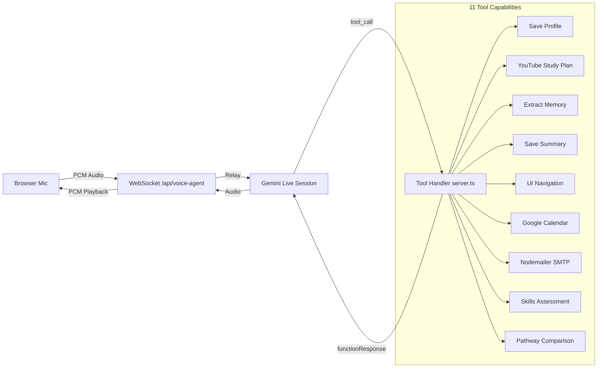

# Agentic AI Architecture

TechIndiana leverages the **Gemini 2.5 Flash Native Audio Preview** (`gemini-2.5-flash-native-audio-preview-12-2025`) via the `@google/genai` SDK to create a real-time, tool-calling voice agent delivered over WebSocket.

## Agent Capabilities

The AI Advisor is an **autonomous agent** that can save profiles, generate study plans, schedule meetings, send emails, navigate the UI, and persist long-term memories — all triggered by natural voice conversation.

## Tool Declarations (server.ts)

All 11 tools are registered as `FunctionDeclaration` objects and passed to the Gemini Live session config. When the model detects user intent, it emits a `toolCall` instead of audio.

| # | Tool Name | Purpose | Parameters | Data Flow |
|---|-----------|---------|------------|-----------|
| 1 | `save_user_profile` | Save name, background, expectations | `name`, `background`, `expectations` | AI → MongoDB `UserProfile` |
| 2 | `generate_youtube_study_plan` | Create dated study plan + fetch YouTube videos | `plan_title`, `missing_skills[]`, `milestones[]` | AI → YouTube Data API → MongoDB → WebSocket → React |
| 3 | `save_conversation_summary` | Persist a 2-3 sentence session summary | `summary` | AI → MongoDB `conversation_summary` |
| 4 | `route_user_to_persona_page` | Redirect user to persona landing page | `target_route` (enum) | AI → WebSocket → React `navigate()` |
| 5 | `schedule_partnership_call` | Book employer partnership call | `company_name`, `contact_name`, `preferred_date`, `preferred_time` | AI → Google Calendar API |
| 6 | `schedule_advisor_call` | Book parent/student advisor call | `attendee_name`, `topic`, `preferred_date`, `preferred_time` | AI → Google Calendar API |
| 7 | `send_counselor_toolkit` | Email counselor resource pack | _(none)_ | AI → Nodemailer SMTP |
| 8 | `send_parent_guide` | Email parent's guide to TechIndiana | _(none)_ | AI → Nodemailer SMTP |
| 9 | `assess_adult_skills` | Map work experience to accelerated pathway | `current_role`, `past_experience` | AI → analysis → WebSocket → React |
| 10 | `show_pathway_comparison` | Push apprenticeship vs. college comparison | `comparison_points[]` (metric, apprenticeship_value, college_value) | AI → WebSocket → React UI table |
| 11 | `extract_and_save_memory` | Persist an important personal fact | `memory_fact` | AI → MongoDB `saved_memories[]` |

## System Instruction & Persona Management

The system instruction is dynamically constructed per user session:

- **User Name**: Injected from Firebase Auth `displayName` (synced to MongoDB on connect).
- **Memory Injection**: If the user has `saved_memories` in their profile, they are appended to the system instruction so the AI can reference past conversations naturally.
- **Voice**: Uses the "Puck" prebuilt voice via `speechConfig`.
- **Modality**: Audio-only responses (`responseModalities: [Modality.AUDIO]`).

The agent adapts to five persona routes:
1. `/students` — Onboarding, tech interests, study plan generation
2. `/adult-learners` — Skill gap analysis, accelerated pathway mapping
3. `/parents` — ROI comparison, apprenticeship vs. college
4. `/employers` — Talent pipeline partnership scheduling
5. `/counselors` — Toolkit delivery, program FAQ

## WebSocket Session Lifecycle

1. **Connect**: Client sends Firebase ID token → server verifies → opens Gemini Live session.
2. **Greeting**: Server sends an initial text prompt with the user's name to trigger a personalized AI greeting.
3. **Audio Loop**: Client streams PCM mic audio → relayed to Gemini → Gemini streams audio back → played in browser.
4. **Tool Calls**: Gemini emits `toolCall` → server executes handler → returns `functionResponse` → Gemini continues.
5. **Transcripts**: Model text parts are saved to `conversation_history` in MongoDB and sent to the frontend.
6. **Heartbeat**: 30-second ping/pong interval detects dead connections before Cloud Run's 10-minute timeout.
7. **Disconnect**: Single `ws.on('close')` tears down Gemini session, clears heartbeat interval.

## Real-time Audio Pipeline

- **Input**: Browser `MediaRecorder` captures PCM audio → chunks sent as base64 over WebSocket.
- **Relay**: Server forwards raw audio to Gemini Live via `sendRealtimeInput({ audio: { data, mimeType } })`.
- **Output**: Gemini streams audio parts back → server relays base64 chunks → browser queues and plays via `AudioContext`.
- **Turn Detection**: `turnComplete` signals from Gemini mark the end of an AI response, enabling the frontend to manage playback state.
