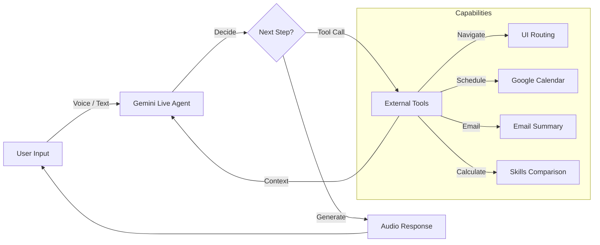

# Agentic AI Architecture

TechIndiana leverages the **Gemini 2.0 Flash (Live)** multi-modal API to create a context-aware, tool-capable agentic system.

## Agent Capabilities

The AI Advisor acts not just as a chatbot, but as an **Autonomous Agent** that can manipulate the user's interface and external services.

## Tool Configuration (server/server.ts)

The agent is configured with a specific tool manifest. When the agent detects user intent, it generates a `tool_call` instead of a text response.

| Tool Name | Purpose | Data Flow |
| :--- | :--- | :--- |
| `route_user_to_persona_page` | Navigation | AI -> Server -> WebSocket -> Frontend `navigate()` |
| `schedule_meeting` | Scheduling | AI -> Server -> Google Calendar API |
| `send_resources` | Resource Delivery | AI -> Server -> Nodemailer SMTP |
| `perform_skills_assessment` | Career Mapping | AI -> Server -> React UI (Result Card) |
| `compare_educational_pathways` | Visualization | AI -> Server -> React UI (Comparison Table) |

## System Instruction & Persona Management

The agent's behavior is governed by a dynamic system instruction based on the user's selected persona:

1. **Student Persona**: Focuses on onboarding, tech interests, and creating a 12-week study plan.
2. **Adult Learner Persona**: Focuses on skill gap analysis and mapping existing professional experience to tech roles.
3. **Parent Persona**: Focuses on value-assessment, ROI, and comparing TechIndiana to 4-year university alternatives.

## Real-time Multi-modal Loop

1. **Audio-to-Audio**: High-fidelity, low-latency voice synthesis via Google.
2. **Context-aware Reasoning**: The agent maintains the conversation state and visual context of the user (e.g., "I see you're looking at the study plan...").
3. **Function Calling**: Seamlessly interweaving conversational guidance with technical execution (e.g., "I've sent that PDF to your email now.").
