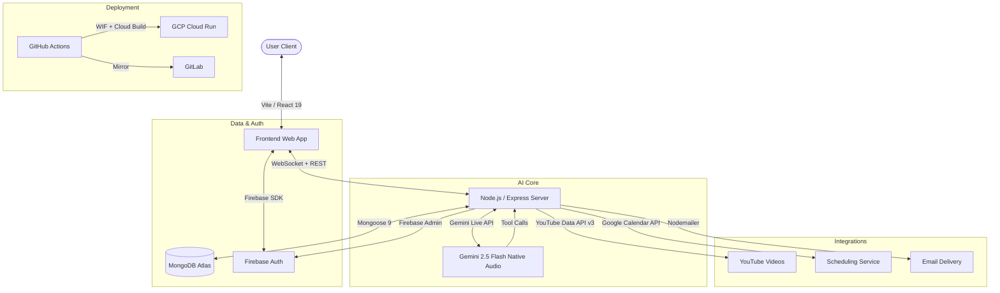

# System Architecture

TechIndiana uses a modern full-stack architecture to facilitate real-time voice interactions, session persistence, role-based access control, and deep integration with external services.

## System Overview



## Frontend Components (src/)

- **App.tsx**: Main layout, routing (React Router DOM), theme state, dual login flow (student vs counselor), voice agent UI.
- **VoiceAgent**: Manages WebSocket connection, microphone input (16kHz PCM), audio queue playback (24kHz), and turn-taking logic.
- **CounselorDashboard.tsx**: Role-gated dashboard for counselors/admins with student management, assignment, and progress tracking.
- **UserProfilePage.tsx**: Profile viewer loading study plans and user data from MongoDB API.
- **Persona Pages**: StudentPage, ParentPage, AdultLearnerPage, EmployerPage, CounselorPage — AI-routable landing pages.
- **Middleware/Auth**: Firebase token handling for WebSocket and REST authentication.

## Backend Components (server/)

- **server.ts**: Main entry point — Express server with WebSocket upgrade handler, Gemini Live session management, 11 tool call handlers, REST API endpoints, ping/pong heartbeat, and `safeSend()` guarded WebSocket messaging.
- **Routes/Session**: `POST /api/session/end` — Ends session, formats study plan HTML with milestones/videos/skills, and emails summary with title-cased names.
- **Middleware/Auth**: `firebaseAuthMiddleware` for REST endpoints, `verifyWebSocketToken` for WS upgrades, `requireRole()` for RBAC.
- **Services/CalendarService**: Google Calendar event creation via OAuth2 service account.
- **Services/EmailService**: Resource distribution (Counselor Toolkit, Parent Guide) via Nodemailer SMTP.
- **Services/YouTubeService**: YouTube Data API v3 search for skill-based tutorial videos.

## API Endpoints

| Method | Path | Auth | Description |
|--------|------|------|-------------|
| WS | `/api/voice-agent` | Token query param | Gemini Live voice session |
| GET | `/api/profile` | Firebase Auth | Load user profile from MongoDB |
| POST | `/api/session/end` | Firebase Auth | End session, email summary |
| GET | `/api/counselor/students` | counselor/admin | List all student profiles |
| GET | `/api/counselor/students/:uid` | counselor/admin | View specific student |
| PUT | `/api/counselor/assign` | counselor/admin | Assign student to counselor |
| PUT | `/api/counselor/unassign` | counselor/admin | Unassign student |
| PUT | `/api/admin/role` | admin only | Set user role |

## WebSocket Lifecycle

1. **Upgrade**: HTTP → WS at `/api/voice-agent?token=...`
2. **Auth**: Token verified (Firebase Admin in prod, `dev:<uid>` in dev)
3. **Gemini Connect**: `ai.live.connect()` with system instruction, 11 tool declarations
4. **Heartbeat**: 30s ping/pong interval detects dead connections
5. **Audio Flow**: Client PCM (16kHz) → Gemini → Response audio (24kHz) → Client queue
6. **Turn-taking**: `speech_start`/`speech_end` signals mute/unmute mic
7. **Close**: Single handler tears down Gemini session + clears heartbeat; client drains audio queue

## Data Flow: Real-time Voice Interaction

1. **Input**: User speaks → Microphone captures PCM audio → Client sends base64 PCM over WebSocket.
2. **AI Processing**: Server forwards PCM to Gemini Live Session.
3. **Decisions**: Gemini determines if a Tool Call (e.g., `generate_youtube_study_plan`) is needed.
4. **Execution**: Server executes the tool call, auto-saves results to MongoDB.
5. **Output**: Gemini's generated response (Audio + Tool Output) is sent back to the Client for playback/render.

## CI/CD Pipeline

```
Push to main → GitHub Actions → Workload Identity Federation → Cloud Build → Cloud Run deploy → GitLab mirror
```

- **Service Account**: `github-actions-deployer@techindiana.iam.gserviceaccount.com`
- **WIF Pool**: `github-pool` / Provider: `github-provider`
- **Cloud Run Service**: `techindiana-voice` in `us-central1`
