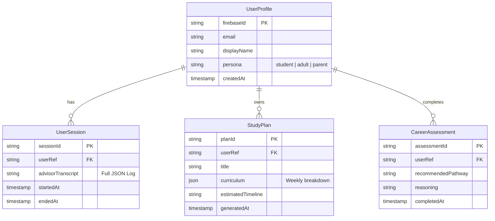

# Database Schema

TechIndiana uses a modern MongoDB-based data model (via Mongoose) to track user progress, scheduled meetings, and generated study plans.

## Collections Overview

## Persona Persistence (src/models/UserProfile.ts)

- **Purpose**: Tracks user's initial onboarding data.
- **Fields**: `name`, `email`, `persona`, `isAccountSetup`.
- **Relationship**: Referenced by `StudyPlan` and `CareerAssessment` via `firebaseId`.

## AI-Generated Data

- **Study Plans**: These are stored in a structured JSON format to allow the frontend to render the "Weekly Plan" cards.
- **Transcripts**: The AI's full dialogue is captured in `UserSession` for future context-aware conversations.
- **Assessments**: Captures the AI's logic for recommending specific pathways (e.g., "Full-stack Web Dev" for an adult learner with a background in logistics).
