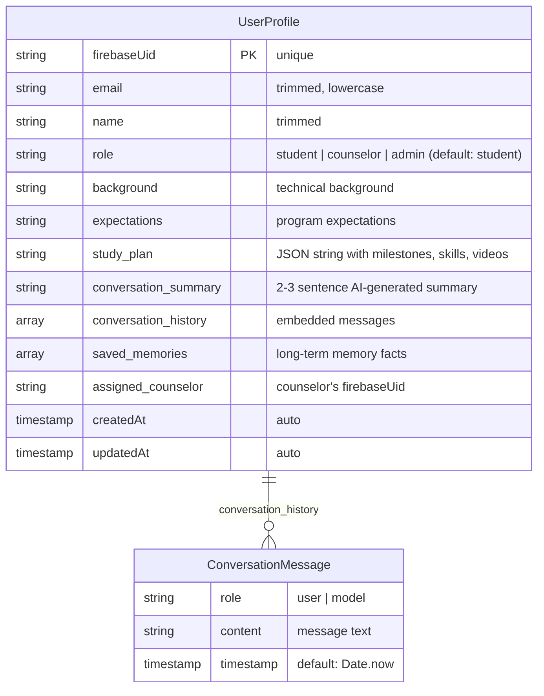

# Database Schema

TechIndiana uses MongoDB Atlas (via Mongoose 9) to persist user profiles, study plans, conversation history, and role-based access data.

## Collection: `userprofiles`



## Schema Definition (src/models/UserProfile.ts)

| Field | Type | Required | Description |
|-------|------|----------|-------------|
| `firebaseUid` | String | Yes (unique) | Firebase Auth UID, primary key |
| `email` | String | No | User email, trimmed and lowercased |
| `name` | String | No | Display name from Google Auth or AI |
| `role` | String enum | No | `student` (default), `counselor`, or `admin` |
| `background` | String | No | Technical background saved by AI |
| `expectations` | String | No | What user expects from TechIndiana |
| `study_plan` | String | No | JSON-serialized study plan with milestones, skills, and YouTube videos |
| `conversation_summary` | String | No | AI-generated 2-3 sentence session summary |
| `conversation_history` | Array | No | Embedded array of `{role, content, timestamp}` messages |
| `saved_memories` | Array | No | Long-term memory facts extracted by AI |
| `assigned_counselor` | String | No | Firebase UID of assigned counselor |

## Study Plan JSON Structure

When stored in `study_plan`, the JSON has this shape:

```json
{
  "plan_title": "Cloud Architect Path for Alex",
  "missing_skills": ["AWS", "Terraform", "Docker"],
  "milestones": [
    {
      "topic": "AWS Foundations",
      "date": "April 20, 2026",
      "action_items": ["Complete AWS Cloud Practitioner course", "Set up free-tier account"]
    }
  ],
  "videos": [
    {
      "skill": "AWS",
      "title": "AWS Tutorial for Beginners",
      "videoId": "abc123",
      "url": "https://www.youtube.com/watch?v=abc123",
      "thumbnail": "https://i.ytimg.com/vi/abc123/default.jpg"
    }
  ]
}
```

## Role-Based Access Control

| Role | Permissions |
|------|-------------|
| `student` | Access voice advisor, view own profile and study plan |
| `counselor` | All student permissions + view all students, assign/unassign students |
| `admin` | All counselor permissions + change user roles via `PUT /api/admin/role` |

The `requireRole()` middleware in `src/middleware/auth.ts` enforces role checks by looking up the user's profile in MongoDB and comparing against allowed roles.

## Data Lifecycle

1. **Profile Creation**: Auto-created on first WebSocket session via `findOneAndUpdate` with `upsert: true`.
2. **Name Sync**: Firebase Auth `displayName` synced to MongoDB on each session start.
3. **Study Plan**: Auto-saved to MongoDB when AI calls `generate_youtube_study_plan` tool.
4. **Conversation History**: Each user/model message appended via `$push` during the voice session.
5. **Memory Extraction**: AI can call `extract_and_save_memory` to persist long-term facts.
6. **Session Email**: `POST /api/session/end` reads the profile and emails a formatted HTML summary.
